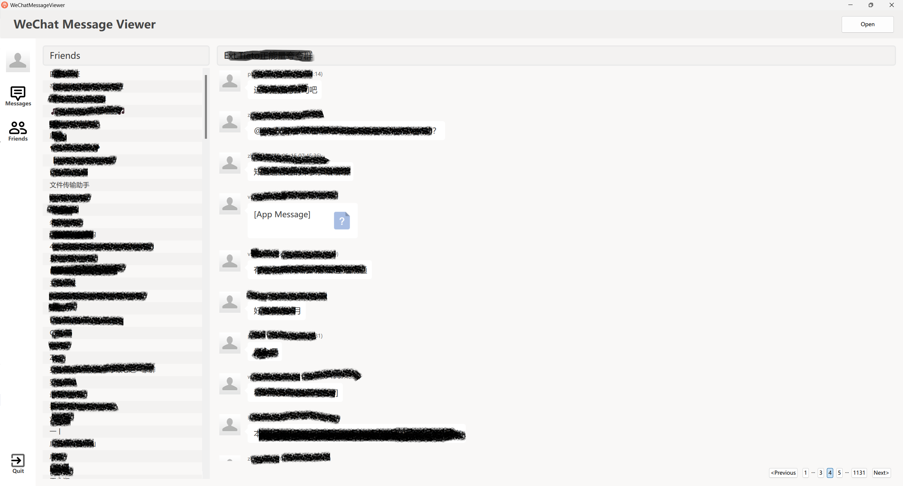
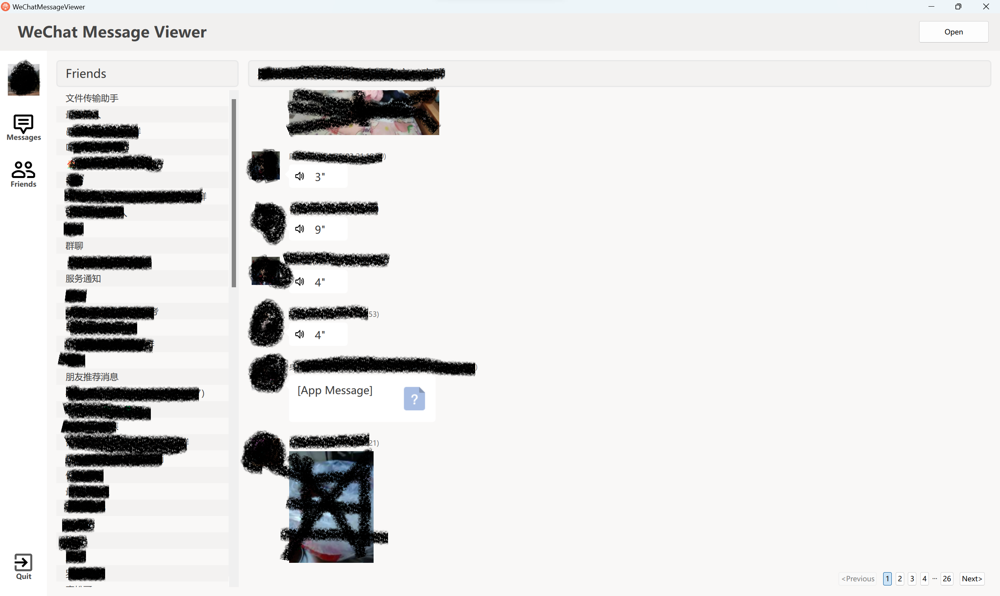
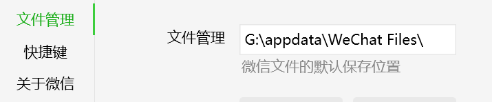
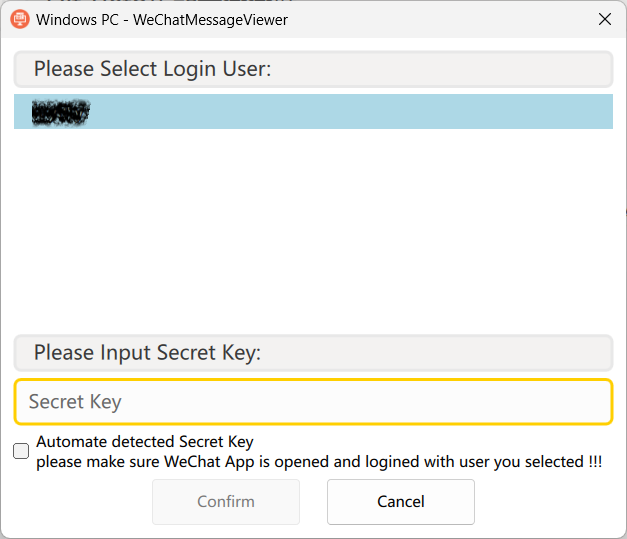

# WeChatMessageViewer
A simple wechat tools. You can use this tool to view your chat message with your firend, without any change or modification to your data. 

Currently support 2 message store types:
* unencrypted ios backup
* Windows PC client

and 3 message type:
* audio
* text
* video

support more store and message type will be available soon.

### how to use

##### unencrypted ios backup
1. click "Open" button
2. select IOS wechat backup folder
3. select login user, and click "Confirm"

##### Windows PC client
1. click "Open" button
2. select WeChat data folder, you can find it in WeChat setting

3. get wechat secret key, there are 2 choises:
    * if your wechat client version is: 3.9.8.25, 3.9.9.43, 3.9.10.27, 3.9.12.17, 3.9.12.45. you can use autodetect by check "Automate detected"
    * if your wechat client version is other than upper, you can this tools [GetWeChatKey](https://github.com/freeide/GetWeChatKey) to get key, then paste it to input box

4. select login user, and click "Confirm"
5. if your key is correct, then you can see your freind and message record

